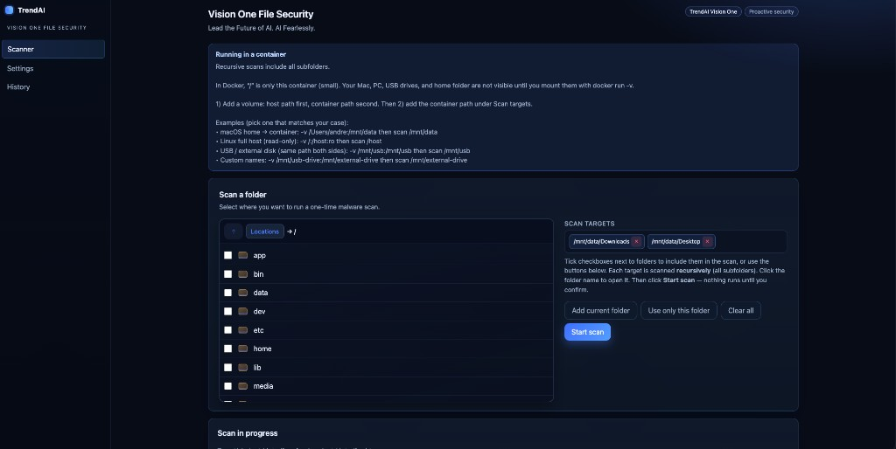
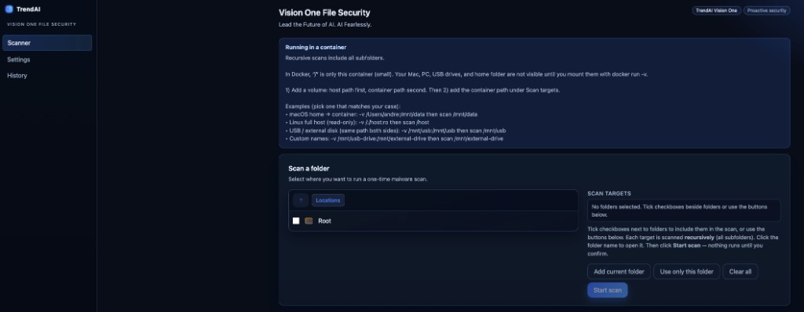
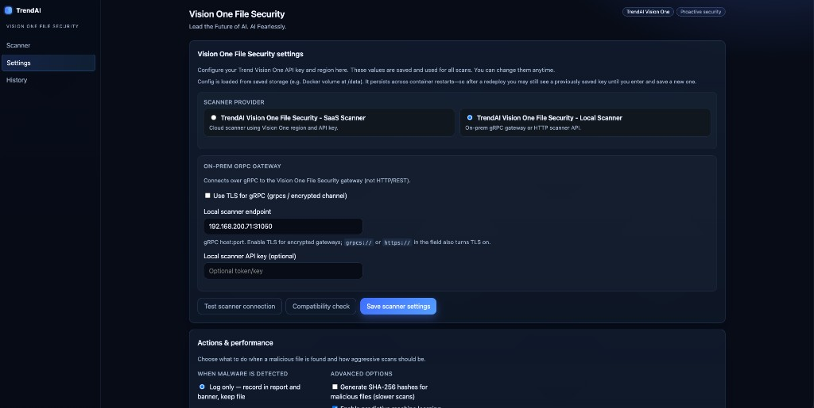
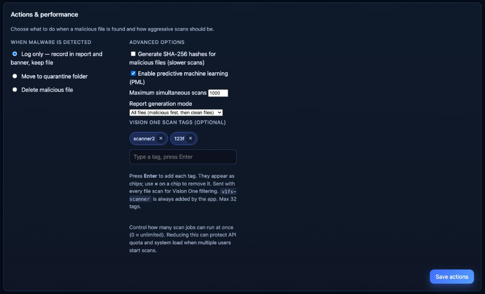
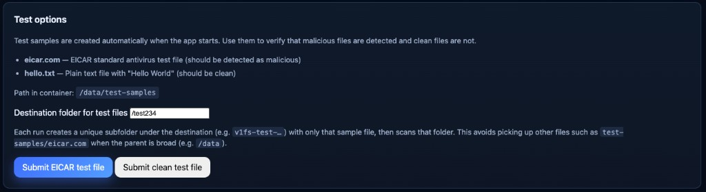
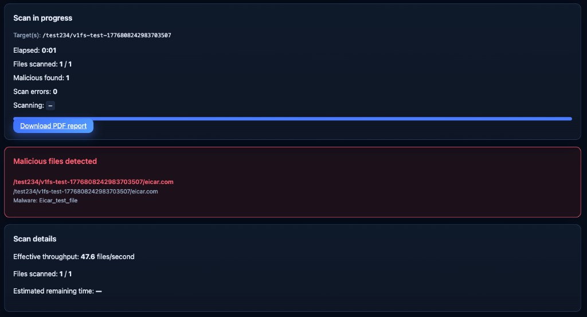

# V1 File Security Scanner

A web-based tool to scan folders for malware using Trend Vision One. No technical knowledge required — just select folders, click scan, and download a report.

---

## Visual Walkthrough

### 1. Scanner Tab — Browse and Select Folders



Browse your drives, select folders to scan, and add them to your scan targets. The app shows a helpful guide when running in Docker.

### 2. Scanner Tab — Navigate Folders



Click folders to navigate, use the **↑ Parent** button to go back, and checkboxes to select what to scan.

### 3. Settings — Configure Scanner



Choose between **SaaS Scanner** (cloud-based) or **Local Scanner** (on-premises). Enter your API key and region, then test the connection.

### 4. Settings — Actions & Performance



Configure what happens when malware is found (log, quarantine, or delete), and set advanced options like scan tags and concurrency limits.

### 5. Settings — Test Options



Run quick tests with sample files to verify your scanner is working correctly before scanning important data.

### 6. Scan Results — Detection Example



Live progress during scanning, with detected malware listed and a PDF report download when finished.

---

## Getting Started (Docker)

### 1. Start the application

```bash
docker run -d -p 8080:8080 \
  -v v1fs-data:/data \
  --name v1fs-scanner \
  v1fs-scanner:latest
```

Then open **http://localhost:8080** in your browser.

### 2. Set up your API key

1. Click **Settings** in the left menu
2. Under **V1 File Security settings**, enter your **Trend Vision One API key** and select your **Region**
3. Click **Save scanner settings**

That's it. Your configuration is saved and will persist even if you restart the application.

---

## How to Scan

### Step 1: Select folders to scan

1. Click **Scanner** in the left menu
2. Use **Locations** to browse your drives and folders
3. Select the folders you want to scan using the checkboxes
4. You can add multiple folders to scan them all in one job

### Step 2: Start the scan

1. Click **Start scan**
2. (Optional) Give your scan a name in the dialog
3. The scan will run — you'll see live progress with:
   - Files scanned so far
   - Any malicious files found
   - Current file being scanned

### Step 3: Download the report

When the scan finishes, click **Download PDF report** to get a detailed report with:
- Total files scanned
- Malicious files detected (if any)
- File paths and malware names
- Scan date and time

---

## Scanning External Drives (USB, External HDD, etc.)

### On Linux or macOS

First, mount the drive on your computer, then add it to Docker when you start:

```bash
docker run -d -p 8080:8080 \
  -v v1fs-data:/data \
  -v /mnt/usb:/mnt/usb:ro \
  --name v1fs-scanner \
  v1fs-scanner:latest
```

Replace `/mnt/usb` with the actual path to your drive.

Then in the app:
1. Click **Scanner**
2. Browse to your drive folder (e.g., `/mnt/usb`)
3. Click **Add current folder**
4. Click **Start scan**

**Tip:** Use `:ro` (read-only) if you only want to scan and report. Remove it if you want the app to quarantine or delete detected files.

---

## Settings Overview

### Scanner Connection
- **API Key**: Your Trend Vision One credentials (required to scan)
- **Region**: Where your API key is registered (e.g., us-east-1, eu-central-1)

### When Malware is Detected
Choose what happens when a malicious file is found:
- **Log only**: Record in report, keep the file
- **Quarantine**: Move to a safe folder
- **Delete**: Remove the file permanently

### Advanced Options
- **Generate SHA-256 hashes**: Add file checksums to reports (slows down scans)
- **Enable predictive machine learning**: Improved detection (available with SaaS scanner)
- **Maximum simultaneous scans**: How many scans can run at the same time (default: unlimited)
- **Report generation mode**: Show just malicious files or all files scanned

### Scan Tags
Add custom labels to your scans for filtering in Vision One:
1. Type a tag name (e.g., "project-x", "usb-drive")
2. Press **Enter**
3. Tags appear as chips — click **×** to remove
4. These tags are included in your PDF report and sent to Vision One

---

## Testing

Before scanning important data, run a quick test:

1. Click **Settings**
2. Scroll to **Test options**
3. Click **Submit EICAR test file** to test if detection works
4. Click **Submit clean test file** to verify clean files are not flagged

Both tests create a sample folder and scan it — results show in real time.

---

## View Scan History

Click **History** to see all past scans with:
- Scan date and time
- Folders that were scanned
- Number of files checked
- Malicious files found
- Download links for previous reports

---

## Troubleshooting

### "Scan connection failed"
- Check your API key in **Settings**
- Make sure you selected the correct region
- Click **Test scanner connection** to verify

### "Only found 300 files when scanning root"
You're probably scanning inside the container, not your actual disk. When using Docker, you must mount your real drives. Example:

```bash
docker run -d -p 8080:8080 \
  -v v1fs-data:/data \
  -v /Users/yourname:/mnt/home:ro \
  --name v1fs-scanner \
  v1fs-scanner:latest
```

Then scan `/mnt/home` instead of `/`.

### Permissions error
Make sure the container can read the folders. Use `:ro` (read-only) flag in Docker if you don't need write access:

```bash
-v /path/to/folder:/mnt/folder:ro
```

---

## Docker Commands Reference

**Start the app**
```bash
docker run -d -p 8080:8080 \
  -v v1fs-data:/data \
  --name v1fs-scanner \
  v1fs-scanner:latest
```

**Stop the app**
```bash
docker stop v1fs-scanner
```

**Restart the app**
```bash
docker restart v1fs-scanner
```

**Remove the app** (keeps your scans and config)
```bash
docker stop v1fs-scanner
docker rm v1fs-scanner
```

**Update to latest version**
```bash
docker pull v1fs-scanner:latest
docker stop v1fs-scanner
docker rm v1fs-scanner
# Then run the docker run command again
```

---

## Features

✅ **Web interface** — No command line required  
✅ **Real-time progress** — See what's being scanned  
✅ **PDF reports** — Download results with details  
✅ **Scan history** — Review past scans anytime  
✅ **Multiple folders** — Scan several locations in one job  
✅ **Scan tags** — Label and organize your scans  
✅ **Custom actions** — Log, quarantine, or delete detected files  
✅ **Persistent config** — Settings saved across restarts  

---

## Supported Regions

- us-east-1 (United States East)
- eu-central-1 (Europe Central)
- eu-west-2 (Europe West)
- ca-central-1 (Canada)
- ap-southeast-1 (Asia Pacific Southeast)
- ap-southeast-2 (Asia Pacific Southeast 2)
- ap-northeast-1 (Asia Pacific Northeast)
- ap-south-1 (Asia Pacific South)
- me-central-1 (Middle East Central)

---

## Environment Variables (Optional)

You can set these when starting the container to pre-configure the app:

| Variable | Purpose | Example |
|----------|---------|---------|
| `TM_V1_API_KEY` | Vision One API key | `docker run -e TM_V1_API_KEY=xyz123...` |
| `TM_V1_REGION` | API region | `docker run -e TM_V1_REGION=us-east-1` |
| `PORT` | Web port inside container | `docker run -e PORT=8080` |

---

## Support

For issues or questions:
1. Check **Troubleshooting** above
2. Review your Vision One API key permissions
3. Run a **Test scanner connection** to verify setup

---

## Build from Source (Developers)

Requires **Go 1.24+**:

```bash
git clone https://github.com/yourusername/tool-v1fs-manual-scan.git
cd tool-v1fs-manual-scan
docker build -t v1fs-scanner:latest .
```

Or without Docker:
```bash
go mod tidy
go build -o v1fs-scanner .
./v1fs-scanner
```

---

## About

Powered by [Trend Vision One™ File Security SDK](https://github.com/trendmicro/tm-v1-fs-golang-sdk)
